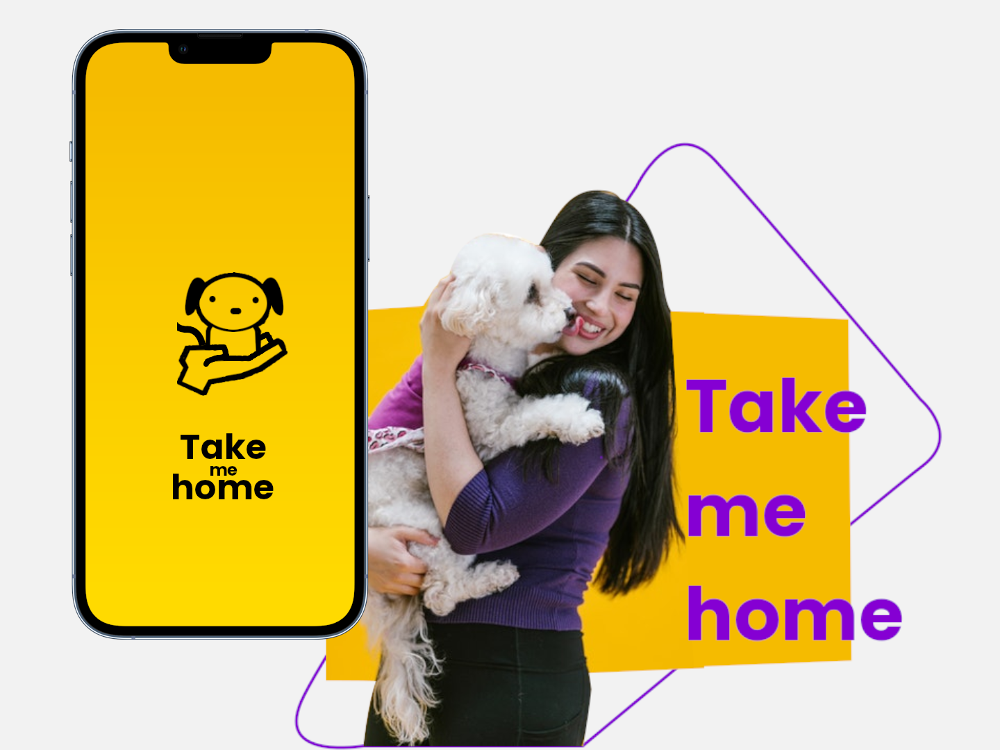

# :cat: :dog: Take me home


:dart: *Take me Home* é uma web-app cujo objetivo é conectar pessoas interessadas em adoção a animais que precisam de novos lares, por meio de uma plataforma moderna que facilita o processo de adoção.

## Sumário
 - :zap: [Início rápido](#zap-início-rápido)
 - :pencil: [Protótipo]()
   - [Considerações iniciais]()
   - [Protótipo de alta fidelidade - Figma]()
   - [Estudo de caso UX / UI]()
   - [Deploy preliminar]()
 - :construction: [Contribua com o projeto]()

<br />
<br />
<br />



<br />
<br />


## :zap: Início rápido

:one: Clone o repositório.
```bash
git clone https://github.com/wellison-md/take-me-home.git
```

<br />

:two: Acesse a pasta do projeto e instale as dependências.
```bash
cd take-me-home/
```
```bash
npm install
```
```bash
npm run install:backend
```
```bash
npm run install:frontend
```

<br />

:three: Inicie o docker compose
```bash
npm run up
```

<br />

:four: Acesse o serviço de backend na porta 3001.
```bash
http://localhost:3001/
```

<br />

:five: Acesse o serviço de frontend na porta 3000.
```bash
http://localhost:3000/
```

<br />
